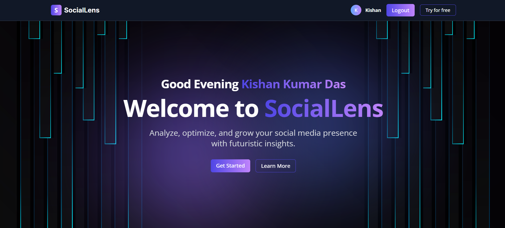
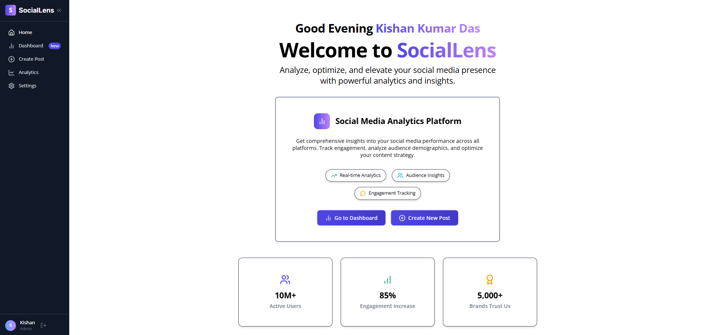

# 📊 SocialLens – Social Media Analytics & Management Platform

**SocialLens** is a futuristic SaaS platform that helps individuals, influencers, and marketing teams analyze, optimize, and grow their social media presence using real-time analytics, intelligent insights, and multi-platform scheduling.




---

## 🚀 Features

- 📈 Real-time analytics dashboard with performance metrics
- 🔍 Competitor analysis and benchmarking
- 📅 One-click multi-platform content scheduling
- 🧩 Seamless integration with social platforms (Meta, LinkedIn, X, TikTok, etc.)
- 📊 Customizable visual reports and performance dashboards
- 🔐 Secure login with JWT & OTP-based password recovery
- 🧠 AI-assisted content optimization (Coming Soon)
- 👥 User roles, team collaboration, and profile settings
- 📚 Developer-friendly documentation, API reference, changelog

---

## 🧠 Tech Stack

| Frontend         | Backend         | Database       | Tools & Styling       |
|------------------|------------------|----------------|------------------------|
| React.js         | Node.js (Express) | MongoDB       | Tailwind CSS, SCSS     |
| React Router     | RESTful APIs      | Mongoose       | React Toastify, Vite   |
| Axios, Zustand   | JWT Auth          |                | Postman, ESLint, Prettier |

---

## 🧭 Major Pages / Modules

- ✅ Landing / Home
- ✅ Auth (Login, Register, Forgot Password, OTP)
- ✅ Dashboard (Analytics + Insights)
- ✅ Create Post (Image + Hashtag + Preview)
- ✅ Settings (Profile, Password, Preferences)
- ✅ Blogs (List, Detail – Markdown/JSON Driven)
- ✅ Guides, Docs, API Reference, Changelog
- ✅ Support, Contact, Terms, Privacy, Careers

---

## 📁 Project Structure

```
sociallens/
├── public/
├── src/
│   ├── assets/
│   ├── components/
│   ├── data/
│   ├── pages/
│   ├── routes/
│   ├── styles/
│   ├── utils/
│   ├── App.jsx
│   ├── main.jsx
├── .env
├── package.json
├── README.md
```

---

## ⚙️ Setup Instructions

### 1. Clone the Repository

```bash
git clone https://github.com/kishankumar2607/SocialLens-FrontEnd.git
cd SocialLens-FrontEnd
```

### 2. Install Dependencies

```bash
npm install
```

### 3. Create Environment Variables

Create a `.env` file in the root and add:

```env
REACT_APP_SECRET_KEY=your_secret_key
```

### 4. Start the Dev Server

```bash
npm start
```

---

## 🔐 Authentication Flow

- Login/Register with Email & Password
- Forgot Password → OTP Verification → Reset Password
- Session managed using JWT (stored in HttpOnly Cookies)
- Redirect logic in protected routes to ensure secure access

---

## 🌐 Deployment

Supports deployment on:
- **Vercel / Netlify / AWS / Microsoft Azure** (Recommended for frontend)
- **Render / Railway / Heroku** (for backend)
- Environment variables must be set in production

---

## 📄 License

This project is licensed under the **MIT License**.  
© 2025 [Kishan Kumar Das](https://github.com/kishankumar2607)
